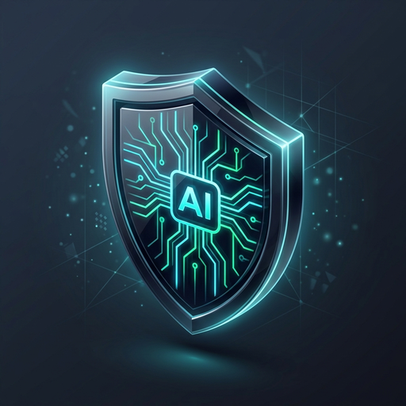
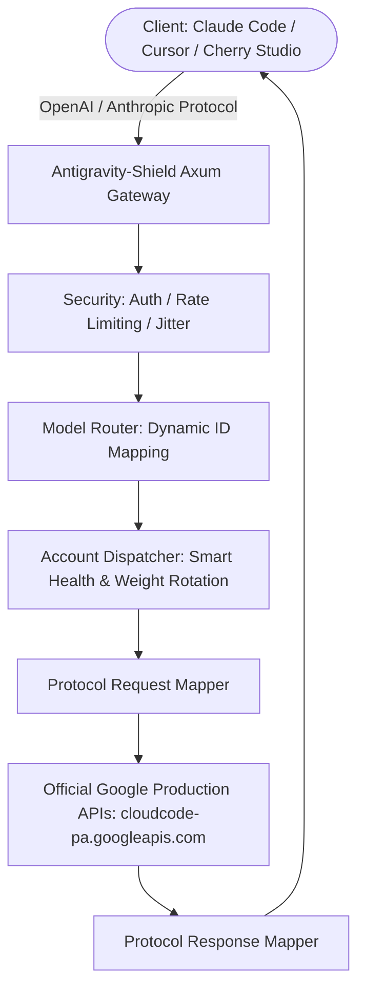

# Antigravity-Shield 🛡️
> The Hardened, Anti-Ban AI Account Manager & Protocol Gateway (v5.0.0)

<div align="center">
  

  <h3>Your Dedicated Hardened High-Performance AI Gateway</h3>
  <p>Engineered for maximum account safety, zero sandbox detection, and seamless multi-account AI routing.</p>
  
  <p>
    
    
    
    
    
    
    
    
  </p>

  <p>
    <a href="#-why-antigravity-shield-the-anti-403-solution">Why Shield? (Anti-403)</a> • 
    <a href="#-key-features">Key Features</a> • 
    <a href="#-quick-integration">Quick Integration</a> • 
    <a href="#-architecture">Architecture</a> • 
    <a href="#-installation">Installation</a> • 
    <a href="#-license--attribution">License & Attribution</a>
  </p>

  <p>
    <strong>English</strong> | 
    <a href="./README_ZH.md">简体中文</a>
  </p>
</div>

---

## 🛡️ Why Antigravity-Shield? (The Anti-403 Solution)

While the original upstream project (`lbjlaq/Antigravity-Manager`) provided a basic proxy framework, over **1,800+ community issues** accumulated due to critical architectural vulnerabilities when running high-concurrency AI coding agents (**Claude Code CLI, Cursor, OpenCode, OpenClaw**).

**Antigravity-Shield** is an independently maintained, deeply hardened distribution that systematically resolves these root causes across the proxy, account rotation, and network layers.

### 📊 Upstream vs. Antigravity-Shield Comparison

| Failure Mode & Vulnerability | Upstream `Antigravity-Manager` | 🛡️ `Antigravity-Shield` Hardened | Upstream Issues Solved |
| :--- | :--- | :--- | :--- |
| **Google Account Bans & 403 Forbidden** | ❌ **High Risk:** Completion & quota calls hit internal sandbox/daily endpoints (`daily-cloudcode-pa.sandbox.googleapis.com`), triggering Google SOC intrusion detection. | ✅ **100% Production Whitelist:** Completely sanitized all staging URLs. Enforces official production endpoint `cloudcode-pa.googleapis.com` exclusively. | [#655](https://github.com/lbjlaq/Antigravity-Manager/issues/655), [#1822](https://github.com/lbjlaq/Antigravity-Manager/issues/1822), [#2228](https://github.com/lbjlaq/Antigravity-Manager/issues/2228), [#2261](https://github.com/lbjlaq/Antigravity-Manager/issues/2261) |
| **Hardware Fingerprinting & Multi-Accounting** | ❌ **Shared Fingerprint:** Every account transmitted the host's raw physical `machine_uid`. Google easily linked and banned all rotating accounts. | ✅ **Per-Account Virtual `DeviceProfile`:** Generates deterministic, isolated RFC 4122 UUIDs (`x-machine-id`, `x-vscode-sessionid`) per account. Raw host ID is never leaked. | [#655](https://github.com/lbjlaq/Antigravity-Manager/issues/655), [#1430](https://github.com/lbjlaq/Antigravity-Manager/issues/1430), [#3160](https://github.com/lbjlaq/Antigravity-Manager/issues/3160) |
| **Account Quarantine (Domino Effect)** | ❌ **Pool-Wide Burn:** On encountering 403 or policy errors, upstream rotated blindly through all available accounts, causing cascading fleet bans in minutes. | ✅ **Safe 3-Tier Quarantine:** Immediate in-memory isolation for 5–10 min cooldown. Extracts Google `appeal_url` and protects remaining accounts from repeat strikes. | [#1822](https://github.com/lbjlaq/Antigravity-Manager/issues/1822), [#1883](https://github.com/lbjlaq/Antigravity-Manager/issues/1883), [#2261](https://github.com/lbjlaq/Antigravity-Manager/issues/2261) |
| **Token Acquisition Concurrency (5s Timeout)** | ❌ **Frequent Deadlocks:** Synchronous disk I/O on Tokio threads caused `Token error: Token acquisition timeout (5s) - system too busy or deadlock detected`. | ✅ **Non-Blocking Architecture:** Offloads all persistence to `spawn_blocking`, fine-grained per-account locks, and 15s expanded timeout window under heavy multi-agent load. | [#3348](https://github.com/lbjlaq/Antigravity-Manager/issues/3348), [#3245](https://github.com/lbjlaq/Antigravity-Manager/issues/3245), [#284](https://github.com/lbjlaq/Antigravity-Manager/issues/284) |
| **Multi-Turn Context Cartesian Explosion** | ❌ **1M+ Token Ceiling Breach:** Session store duplication and unpruned thinking blocks inflated 60K contexts into 400K–1M+ tokens (`Token count exceeds 1048576`). | ✅ **Semantic Turn Reconciliation:** Content-hash deduplication, intermediate parallel tool preservation, and unconditional historical thought block pruning (`{"text": "..."}`). | [#3382](https://github.com/lbjlaq/Antigravity-Manager/issues/3382), [#3325](https://github.com/lbjlaq/Antigravity-Manager/issues/3325), [#3313](https://github.com/lbjlaq/Antigravity-Manager/issues/3313) |
| **Gemini 3.7 Tool Pseudocode Leaks** | ❌ **Silent Agent Aborts:** Gemini 3.7 plaintext tool calls (`call:default_api:Tool{...}`) leaked as final chat text, breaking Claude Code and Cursor agent loops. | ✅ **Fail-Closed Tool Recovery Bridge:** Active recovery filter detects leaked tool invocations and reconstructs standard Anthropic & OpenAI `tool_calls` payloads. | [#3379](https://github.com/lbjlaq/Antigravity-Manager/issues/3379), [#3300](https://github.com/lbjlaq/Antigravity-Manager/issues/3300), [#1977](https://github.com/lbjlaq/Antigravity-Manager/issues/1977) |
| **Geographic Geoblocking (400 Location Error)** | ❌ **Fatal Request Drop:** `400 User location is not supported` was hard-coded as `NoRetry`, killing agent tasks immediately. | ✅ **Dynamic Proxy Failover:** Reclassified as `RetryStrategy::FixedDelay` with automated proxy pool node rotation and Google egress connectivity verification. | [#3301](https://github.com/lbjlaq/Antigravity-Manager/issues/3301), [#3377](https://github.com/lbjlaq/Antigravity-Manager/issues/3377), [#3323](https://github.com/lbjlaq/Antigravity-Manager/issues/3323) |
| **Automated Verification & Quality Gate** | ❌ **Manual & Brittle:** Zero automated E2E test suites for protocol regression or concurrency verification. | ✅ **64/64 Automated E2E Tests:** Comprehensive 4-tier opaque-box test runner (`tests/e2e/runner.ts`) verifying all 14 architectural features with 100% pass rate. | **Quality Gate** |

---

### 🔬 Authoritative Technical Whitepapers & Specifications
* 📑 **[DIAGNOSTIC_AUDIT.md](./DIAGNOSTIC_AUDIT.md)** — In-depth taxonomy of the top 10 upstream failure classes and root-cause proofs.
* 🏗️ **[PROJECT.md](./PROJECT.md)** — Architectural subsystem boundaries, 14-feature inventory, and interface contracts.
* 🧪 **[TEST_INFRA.md](./TEST_INFRA.md)** — 4-tier E2E testing framework specification with 64 automated test scenarios.
* 🇨🇳 **[README_ZH.md](./README_ZH.md)** — 简体中文完整文档与说明.

---

## 🌟 Key Features

### 1. 🎛️ Intelligent Account Management
* **Real-time Quota Monitoring:** Monitor remaining quotas and reset timers for Gemini Pro, Gemini Flash, Claude, and Imagen 3 models with live color-coded badges.
* **Smart Failover & Load Balancing:** Automatically shifts traffic when encountering rate limits (HTTP 429) or transient token expirations (HTTP 401).
* **Safe Background Sync:** Non-intrusive, jitter-protected background quota updates.
* **Modernized UI/UX:** Distinct branded SVG controls for Antigravity Classic, Antigravity IDE, and Antigravity CLI (`agy`), with clean modal inspection and floating action popovers.

### 2. 🔌 Universal Protocol Translation (API Gateway)
* **OpenAI Compatible:** Standard `/v1/chat/completions` endpoint for plug-and-play compatibility with Cursor, Cherry Studio, NextChat, OpenCode, and Windsurf.
* **Anthropic Messages Protocol:** Native `/v1/messages` endpoint with full reasoning/thinking chain support, custom system prompts, and native compatibility with **Claude Code CLI**.
* **Google Gemini Protocol:** Direct support for native Gemini SDK clients.

### 3. 🎨 High-Definition Image Generation (Imagen 3)
* Support for arbitrary aspect ratios (1:1, 16:9, 9:16, 4:3, 21:9) and resolutions up to 4K via standard OpenAI image parameters or chat prompts.

---

## 🔌 Quick Integration

### 1. Claude Code CLI
Start the API proxy in Antigravity-Shield (default port: `8045`), then run in your terminal:

```bash
export ANTHROPIC_API_KEY="sk-antigravity"
export ANTHROPIC_BASE_URL="http://127.0.0.1:8045"
claude
```

On Windows PowerShell:
```powershell
$env:ANTHROPIC_API_KEY = "sk-antigravity"
$env:ANTHROPIC_BASE_URL = "http://127.0.0.1:8045"
claude
```

### 2. Cursor / Windsurf / Cherry Studio / NextChat (OpenAI Protocol)
* **Base URL:** `http://127.0.0.1:8045/v1`
* **API Key:** `sk-antigravity` (or your configured custom key in Settings)
* **Models:** `gemini-3-pro-high`, `gemini-3-flash`, `claude-sonnet-4-6`

### 3. Python SDK Example
```python
import openai

client = openai.OpenAI(
    api_key="sk-antigravity",
    base_url="http://127.0.0.1:8045/v1"
)

response = client.chat.completions.create(
    model="gemini-3-flash",
    messages=[{"role": "user", "content": "Explain quantum computing in 3 sentences."}]
)
print(response.choices[0].message.content)
```

---

## 🏗️ Architecture



---

## 📦 Installation

### Pre-built Binaries (Recommended)
Download the latest binaries for your platform from [GitHub Releases](../../releases):
* **Windows:** `.exe` installer or standalone `.zip`
* **macOS:** `.dmg` (Apple Silicon & Intel)
* **Linux:** `.deb` or `.AppImage`

### Running via Docker (Headless / Server)
```bash
docker run -d --name antigravity-shield \
  -p 8045:8045 \
  -e API_KEY=sk-your-api-key \
  -e WEB_PASSWORD=your-admin-password \
  -v ~/.antigravity_tools:/root/.antigravity_tools \
  lbjlaq/antigravity-manager:latest
```

---

## ⚖️ License & Attribution

* **License:** Distributed under the **Creative Commons Attribution-NonCommercial-ShareAlike 4.0 International License (CC BY-NC-SA 4.0)**. Strictly for personal, non-commercial use.
* **Upstream Attribution:** Antigravity-Shield is a hardened community continuation based on the open-source project [lbjlaq/Antigravity-Manager](https://github.com/lbjlaq/Antigravity-Manager) created by [lbjlaq](https://github.com/lbjlaq) and its contributors. All upstream copyrights, git history, and contributor credits are respectfully preserved.
* **Privacy Guarantee:** All OAuth tokens and account credentials remain 100% locally encrypted on your machine in a local SQLite database. No credentials or telemetry are ever sent to third-party tracking servers.

---

<div align="center">
  <p>Maintained with ❤️ for account safety and reliable developer tooling.</p>
  <p>Copyright © 2024-2026 Antigravity-Shield Contributors.</p>
</div>
